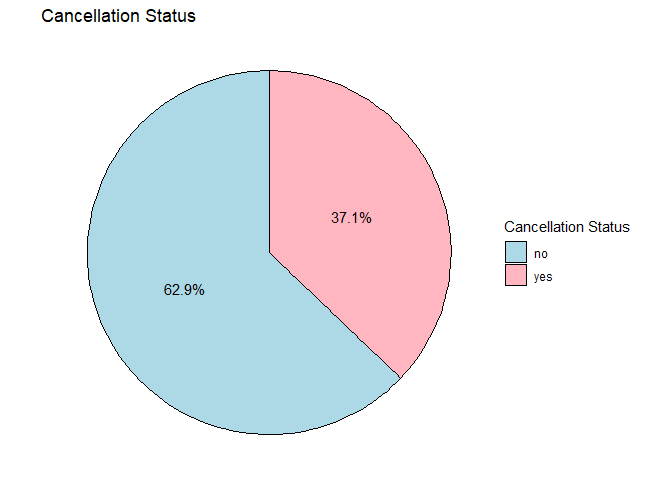
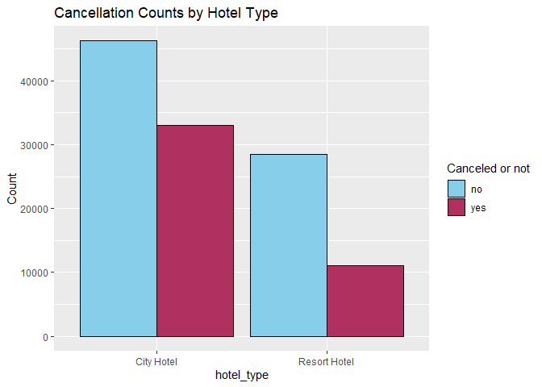
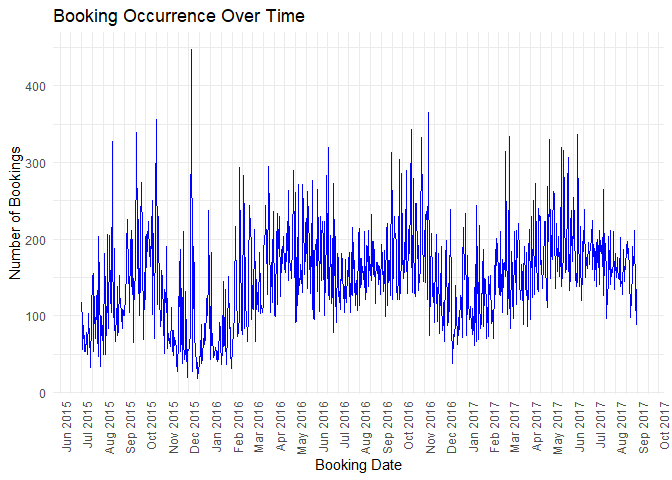
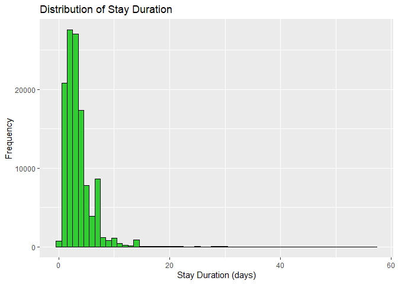
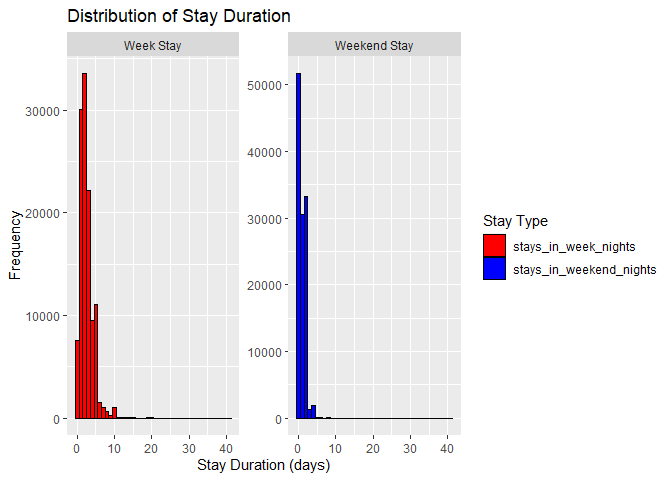
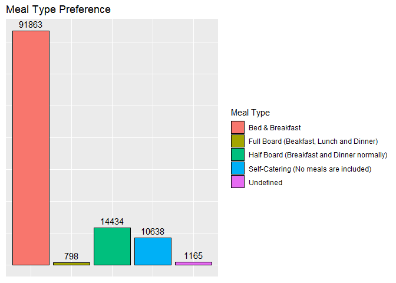
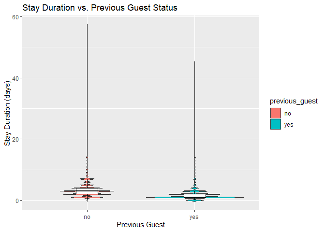
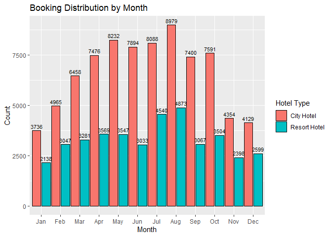
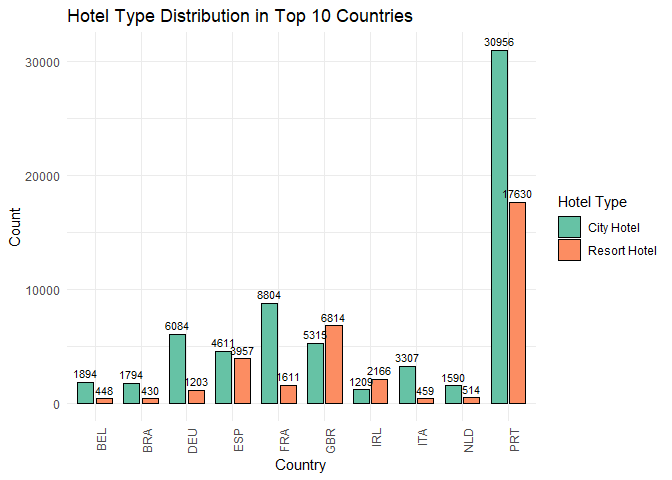
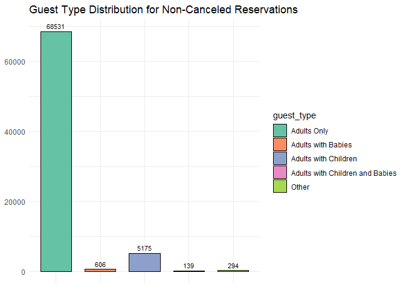

Visual Analysis of Hotel Bookings Dataset
================
Dominik Vukelic

# Creating a pie chart with percentages for cancelations

<!-- -->

# Creating a grouped Bar Plot for Cancellation Counts by Hotel Type

<!-- -->

# Creating a plot for Booking Occurrence Over Time

<!-- -->

# Creating a histogram for stay durations

<!-- -->

# Creating a bar plot for meal type

# Creating a violin plot to compare stay duration for previous and non-previous guests

<!-- -->

# Creating a bar plot for booking distribution by month

<!-- -->

# Creating a grouped bar plot for the top 10 countries showing the counts of each hotel type

<!-- -->

# Creating a grouped bar chart for non-canceled reservations and guest types

<!-- -->

# Creating a histogram for booking changes

<!-- -->
